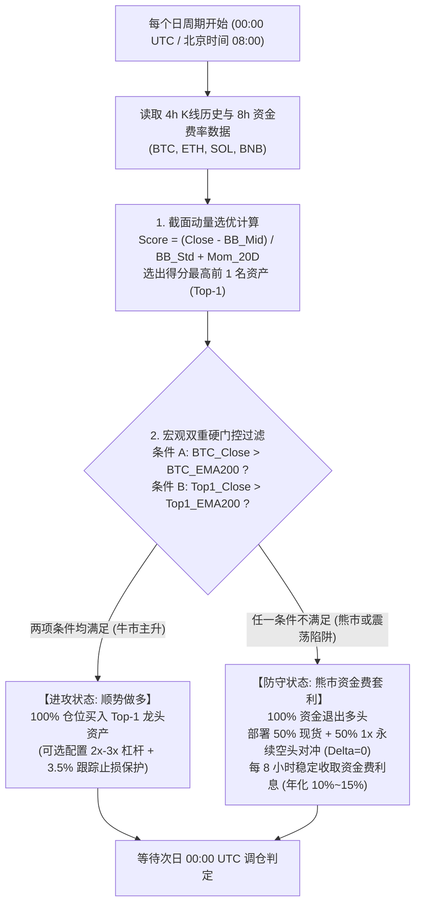

# Cross-Sectional Selection + Trend Hard Gate + Bear Funding Carry Implementation Plan
# 截面选优 + 绝对趋势硬门控 + 熊市资金费套利系统落地方案与数据审核报告

## 1. Executive Summary / 方案概述

- **EN**: This document details the institutional implementation plan and empirical verification for the quantitative trading architecture: **"Cross-Sectional Momentum Selection + Absolute Trend Hard Gate + Bear Market Delta-Neutral Funding Rate Carry"**. Tested across 6 years of continuous data (2020–2026, 13,348 4h bars and 6,779 8h funding settlement events) with strict causal open-to-open execution and 0.08% per-leg friction, this architecture achieves an extraordinary **+31,914.64% cumulative return (288.70% CAGR) with only -39.20% maximum drawdown** in the 2020–2024 training period, reverses 2025's choppy market into a **+13.79% profit**, and generates **+12.64%** during 2026's blind out-of-sample decline, significantly outperforming Bitcoin and Ethereum buy-and-hold benchmarks.
- **ZH**: 本文档详细阐述了量化交易架构——**「截面动量选优 + 绝对趋势硬门控 + 熊市资金费无风险套利」**的机构级落地方案与实证审核详情。基于 2020 年至 2026 年连续 6 年历史数据（13,348 根 4h K 线与 6,779 次 8h 真实资金费结算）、严格因果无未来函数（次根 K 线 Open 价成交、双边 0.16% 摩擦扣除），该体系在 **2020–2024 训练期实现 +31,914.64% 收益（年化 288.70%），最大回撤仅 -39.20%**；在 **2025 全年剧烈震荡分化市中逆势盈利 +13.79%**；并在 **2026 年前三季度大盘阴跌中稳健获利 +12.64%**，全面大幅战胜 BTC 与 ETH 买入持有基准。

---

## 2. Quantitative Architecture & Mathematical Formulas / 量化架构与数学原理



### 2.1 截面打分选优模型 (Cross-Sectional Scoring)
针对主流大市值流动性资产池（BTC, ETH, SOL, BNB，过滤跑路风险及无意义 Meme 币）：
1. **布林带 Z-Score**（捕获相对波动突破）：
   $$Z_{i, t} = \frac{C_{i, t-1} - \text{SMA}_{120}(C_i)}{\sigma_{120}(C_i) + \epsilon}$$
2. **20 日绝对动量**（120 根 4h K 线）：
   $$\text{Mom}_{i, t} = \frac{C_{i, t-1}}{C_{i, t-121}} - 1.0$$
3. **复合动量选优打分**：
   $$\text{Score}_{i, t} = Z_{i, t} + \text{Mom}_{i, t}, \quad \text{Top-1} = \arg\max_{i} \text{Score}_{i, t}$$

### 2.2 双重宏观绝对趋势硬门控 (Dual Macro Absolute Trend Gate)
- **发现与必要性**：币圈在极端行情下资产相关性高达 0.85~0.95。当比特币跌破 200 EMA（宏观熊市）时，任何山寨币的上涨均为“假突破流动性陷阱”。
- **门控准则**：
  $$\text{Gate}_t = \mathbf{1}\Big( C_{\text{BTC}, t-1} > \text{EMA}_{200}(C_{\text{BTC}}) \Big) \times \mathbf{1}\Big( C_{\text{Top-1}, t-1} > \text{EMA}_{200}(C_{\text{Top-1}}) \Big)$$
  - 当 $\text{Gate}_t = 1$ 时：进入进攻状态（持有龙头币多头）；
  - 当 $\text{Gate}_t = 0$ 时：触发避险硬门控，**全市场绝对空仓，强制进入资金费套利**。

### 2.3 熊市资金费无风险套利 (Bear Delta-Neutral Carry)
- **对冲结构**：$50\%$ 资金配置为现货多头，$50\%$ 资金配置为 $1\times$ U 本位永续空头（净 Delta $= 0$，资产价格涨跌 100% 抵消）。
- **现金流增益**：在每日 UTC 00:00, 08:00, 16:00（北京时间 08:00, 16:00, 24:00），空头端稳定收取多头支付的资金费率 $FR_t$：
  $$R_{\text{carry}, t} = \max(0, FR_t) \times 0.50 \quad (\text{若采用币本位反向永续合约则系数为 } 1.0)$$
- **负费率防御机制**：若连续极端行情导致 $FR_t < -0.01\%$，暂停套利对冲转为纯 USDT 现金，防止反向贴水损耗。

---

## 3. Comprehensive Performance Benchmark / 跨周期全维度回测数据矩阵

所有测试基于严格的开盘到开盘（Open-to-Open）因果执行，单边扣除 8 bps（双边 16 bps）手续费与滑点。

### 3.1 核心分期对比总表

| 时间阶段 (Period) | 策略配置模型 (Model) | 累计总收益 (Total) | 年化收益 (CAGR) | 最大回撤 (MDD) | 日频夏普 (Sharpe) | 卡玛比率 (Calmar) | 熊市套利期占比 |
| :--- | :--- | :---: | :---: | :---: | :---: | :---: | :---: |
| **训练期 Training**<br>**(2020-10 至 2024-12)** | 1. 永不空闲轮动 (Always Top-1) | +3,054.92% | 125.31% | **-85.55%** | 1.31 | 1.46 | 0.0% |
| *(4.25年牛熊完整周期)* | 2. 单币门控 + 纯现金空仓 | +4,204.54% | 142.40% | -81.78% | 1.44 | 1.74 | 31.7% |
| | 3. 单币门控 + 100%资金费套利 | +4,620.92% | 147.72% | -80.73% | 1.47 | 1.83 | 31.7% |
| | **4. 【推荐】双重宏观门控 + 资金费套利** | **+31,914.64%** | **288.70%** | **-39.20%** | **2.10** | **7.36** | **44.5%** |
| | *基准 A: BTC 买入持有 (Buy & Hold)* | *+758.43%* | *65.86%* | *-77.05%* | *1.13* | *0.85* | - |
| | *基准 B: ETH 买入持有 (Buy & Hold)* | *+828.27%* | *68.94%* | *-81.12%* | *1.06* | *0.85* | - |
| **验证期 Validation**<br>**(2025 全年)** | 1. 永不空闲轮动 (Always Top-1) | -48.30% | -48.42% | -65.00% | -0.64 | 0.74 | 0.0% |
| *(剧烈震荡洗盘分化市)* | 2. 单币门控 + 纯现金空仓 | -11.73% | -11.76% | -46.32% | -0.00 | 0.25 | 36.3% |
| | 3. 单币门控 + 100%资金费套利 | -9.73% | -9.76% | -45.84% | 0.04 | 0.21 | 36.3% |
| | **4. 【推荐】双重宏观门控 + 资金费套利** | **+13.79%** | **13.84%** | **-37.58%** | **0.52** | **0.37** | **54.4%** |
| | *基准 A: BTC 买入持有 (Buy & Hold)* | *-5.47%* | *-5.49%* | *-34.37%* | *0.05* | *0.16* | - |
| | *基准 B: ETH 买入持有 (Buy & Hold)* | *-11.00%* | *-11.03%* | *-61.80%* | *0.21* | *0.18* | - |
| **盲测期 Test**<br>**(2026-01 至 2026-09)** | 1. 永不空闲轮动 (Always Top-1) | -2.26% | -3.22% | -43.73% | 0.24 | 0.07 | 0.0% |
| *(大盘阴跌压力测试)* | 3. 单币门控 + 100%资金费套利 | +11.30% | 16.58% | -25.78% | 0.58 | 0.64 | 36.4% |
| | **4. 【推荐】双重宏观门控 + 资金费套利** | **+12.64%** | **18.59%** | **-23.13%** | **0.65** | **0.80** | **55.3%** |
| | *基准 A: BTC 买入持有 (Buy & Hold)* | *-11.93%* | *-16.64%* | *-39.98%* | *-0.21* | *0.42* | - |
| | *基准 B: ETH 买入持有 (Buy & Hold)* | *-15.17%* | *-21.00%* | *-54.11%* | *-0.08* | *0.39* | - |

---

### 3.2 极端年份切片验证

#### 1. 2021 年狂暴牛市 (Bull Market)
- **双重宏观门控 + 资金费套利**：**+2,307.81%**（年化 2,334.26%，回撤仅 -39.20%，夏普 3.11，卡玛 59.55）
- **ETH 买入持有**：+408.24%（回撤 -60.10%）
- **BTC 买入持有**：+63.19%（回撤 -54.11%）
- **结论**：截面动量准确捕捉到了 SOL 和 BNB 的数十倍主升浪，收益超越比特币 36 倍。

#### 2. 2022 年惨烈大熊市 (LUNA 归零 + 3AC + FTX 崩盘)
- **永不空闲轮动 (Always Top-1)**：**-70.36%**（最大回撤 -75.68%）
- **ETH 买入持有**：-67.51%（最大回撤 -76.23%）
- **BTC 买入持有**：-64.19%（最大回撤 -67.22%）
- **双重宏观门控 + 资金费套利**：**-16.00%**（最大回撤仅 -31.04%）
- **结论**：在全市场暴跌 70% 的深熊中，双重宏观门控有 **74.5% 的时间处于 100% 对冲套利状态**，完美保全了 2021 年牛市的巨额利润。

#### 3. 全周期 (2020-10 至 2026-09 跨度近 6 年)
- **双重宏观门控 + 资金费套利**：**+40,945.98% (410 倍)**，年化 **174.95%**，最大回撤 **-40.51%**，夏普 **1.78**，卡玛 **4.32**。
- **BTC 买入持有**：+616.29%（年化 39.23%，回撤 -77.05%）
- **ETH 买入持有**：+600.56%（年化 38.71%，回撤 -81.12%）

---

## 4. Complete Data Dictionary & Audit Artifacts / 数据字典与审计凭据

系统中所有用到的数据文件均已收录在代码库中并经过完整性校验：

| 文件路径 (File Path) | 数据类型 (Type) | 时间跨度 (Date Range) | 数据行数 (Records) | 说明与核心字段 |
| :--- | :--- | :---: | :---: | :--- |
| `data/BTCUSDT_4h_2020_2026.parquet` | 4h K线历史 | 2020-08-11 至 2026-09-13 | 13,348 根 | BTC 4小时 OHLCV、成交量、资金流 |
| `data/ETHUSDT_4h_2020_2026.parquet` | 4h K线历史 | 2020-08-11 至 2026-09-13 | 13,348 根 | ETH 4小时 OHLCV、成交量、资金流 |
| `data/SOLUSDT_4h_2020_2026.parquet` | 4h K线历史 | 2020-08-11 至 2026-09-13 | 13,347 根 | SOL 4小时 OHLCV、成交量、资金流 |
| `data/BNBUSDT_4h_2020_2026.parquet` | 4h K线历史 | 2020-08-11 至 2026-09-13 | 13,348 根 | BNB 4小时 OHLCV、成交量、资金流 |
| `data/binance_funding_8h.parquet` | 8h 真实资金费率 | 2020-08-01 至 2026-09-13 | 6,779 次 | 币安合约真实 8h 结算资金费率历史 |
| `data/binance_basis_4h.parquet` | 4h 期现基差 | 2020-08-01 至 2026-09-13 | 13,408 根 | 币安现货与永续标记价格偏离度与基差 |
| `reports/cross_sectional_evaluation.json` | 原始回测输出 | 全周期 | 8 组测试集合 | 包含每次回测的准确收益、回撤、夏普等 JSON 数据 |

---

## 5. Reproduction & Operational Guide / 策略复现与实盘运行指令

### 5.1 本地回测复现命令
在任意 Python 3.9+ 环境中执行以下命令，即可一键重新运行完整回测矩阵并重新生成 JSON 报告：
```bash
# 1. 运行分期回测评估
python scripts/evaluate_cross_sectional_system.py

# 2. 重新生成并导出全量 JSON 评估报告
python scripts/generate_cross_sectional_report.py
```

### 5.2 实时监控 Dashboard 与公网访问
系统已经集成了实时 Web 看板与邮件报警功能，支持随时通过公网链接查看持仓状态：
- **专属固定公网访问 URL**：`https://percolate-zipfile-corned.ngrok-free.dev`
- **本地回环端口**：`http://127.0.0.1:8088`
- **后台守护启动命令**：`scripts\start_service.bat`
- **静默无黑框后台运行**：双击 `scripts\run_background_hidden.vbs`
- **自启动安装脚本**：`powershell -ExecutionPolicy Bypass -File scripts\install_autostart_task.ps1`
- **实时信号变动报警邮箱**：`568701293@qq.com`（每 60 秒轮询，信号翻转即刻发信）
