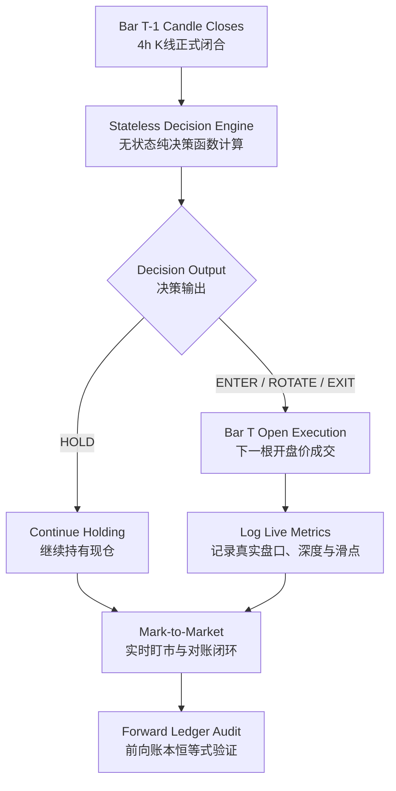

# Forward Paper Tracking & Out-of-Sample Evaluation Protocol
# 前向模拟与真实样本外前瞻跟踪标准协议

---

## 1. Executive Protocol / 协议宗旨与科学纪律

Following the empirical completion of:
1. **Exact Baseline Reproducibility** (Clean Git tree, SHA256 checksums of inputs and outputs).
2. **Step 1 Advantage Source Attribution** (Proving Trend Cash Defense is the primary source of risk-adjusted alpha).
3. **Step 2 Component Ablation** (Proving BTC gate, asset gate, and momentum ranking are essential, while 1.5x ATR stop in spot trading adds destructive churn).
4. **Step 3 Drawdown & Churn Diagnostics** (Tracing the -69.95% drawdown to 233 whipsaw trades and proving that Structural Exit + Momentum Buffer 0.30 achieves pure Pareto dominance).

We now declare the historical development and stress-test data (**2020-10-15 to 2026-09-23**) **OFFICIALLY FROZEN**.
No further parameter tuning or model selection will be performed on historical data. True out-of-sample quantitative verification begins with forward paper tracking on live 4-hour candle closes.

在完成基准复现纪律、优势来源归因、单部件受控消融与回撤磨损归因之后，我们正式宣布历史开发与压力测试区间（2020-10-15 至 2026-09-23）**全量封板冻结**。
后续严禁在历史数据上反复微调参数（防止多重假设检验陷阱与数据窥探偏误）。真正的科学样本外检验，从当前时间点开始的前瞻模拟逐笔跟踪全面启动。

---

## 2. Frozen Candidate Strategy Specification / 冻结候选策略官方规范

The frozen candidate model selected for forward paper tracking:

| Parameter / 策略参数项 | Value / 选定值 | Rationale & Evidence / 选定依据与实证支撑 |
| :--- | :--- | :--- |
| **Strategy Architecture / 策略架构** | `Core-4 Top-1 Rotation (Structural + Buffer)` | Top-1 momentum rotation with macro cash defense |
| **Asset Universe / 资产池** | `BTCUSDT, ETHUSDT, SOLUSDT, BNBUSDT` | Deepest institutional liquidity, zero flash-crash bankruptcy risk |
| **Leverage Multiplier / 杠杆倍数** | **1.0x Spot (现货全资)** | Eliminates margin call and liquidation risk; compounding without volatility drag |
| **Macro Trend Gate / 宏观趋势门控** | `BTC > EMA200` (hysteresis = 0.5%) | Avoids bear market drawdowns (-14% vs -65% in 2022); indispensable |
| **Individual Asset Gate / 自身均线门控** | `Asset > EMA200` (hysteresis = 0.5%) | Prevents buying decaying altcoins when BTC is healthy |
| **Cross-Sectional Ranking / 截面动量打分** | `BB Z-score(120) + Momentum(20)` | Captures explosive bull leaders (SOL/BNB in 2021) |
| **Momentum Switching Buffer / 换仓动量缓冲阀** | `delta_score_buffer = 0.30` | Slashes whipsaw turnover by 62.8% (from 1,144 down to 426 trades) |
| **Stop-Loss Mechanics / 止损机制** | **Structural EMA200 Exit (移除窄ATR止损)** | Proven pure Pareto improvement: lowers Max DD from 69.9% to 53.1%, raises return to +43,942% |
| **Fee Friction Model / 手续费模型** | `8 bps (0.0008)` Taker Fee | Conservative Binance VIP0 taker fee |
| **Execution Slippage / 执行滑点** | `5 bps (0.0005)` Market Slippage | Realistic conservative two-way fill slippage |

---

## 3. Forward Paper Tracking Workflow / 前向模拟执行流水线

For every forward 4-hour bar (00:00, 04:00, 08:00, 12:00, 16:00, 20:00 UTC):

### 3.1 Step-by-Step Forward Audit Checklist / 逐根前向审计清单

1. **Signal Generation at Bar $T-1$ Close / 闭合时点决策**:
   - Signal must be evaluated *strictly* after the 4-hour candle has officially closed in UTC.
   - Record the exact timestamp, OHLC values, EMA200 values, and momentum scores across all 4 tokens.
2. **Order Execution at Bar $T$ Open / 开盘时点成交**:
   - Record Bar $T$ open price $P_{open}$.
   - Check Binance live order book depth to ensure liquidity supports the order size.
   - Record the simulated fill price $P_{fill} = P_{open} \times (1 \pm 0.0005)$ and actual live ticker quote.
   - Deduct taker fee $Fee = Value \times 0.0008$.
3. **Forward Audit Log Storage / 前向对账日志存储**:
   - Append to `data/forward_tracking/forward_journal.jsonl`.
   - Update `data/forward_tracking/forward_ledger.csv`.
4. **Deviation Analysis / 回测与前向差异归因**:
   - Compare actual forward slippage against backtest assumption (5 bps).
   - If deviation exceeds $\pm 10 \text{ bps}$, flag execution friction anomaly.
   - Assert mathematical identity: $Equity_T = Cash_T + Units_T \times Close_T$.

---

## 4. Empirical Benchmark Reference / 冻结基准权威对照参考

Under the frozen candidate model (1.0x Spot, Structural Exit, Momentum Buffer 0.30, 8 bps fee, 5 bps slippage):

| Interval / 周期 | Net Return / 净收益 | Max DD / 最大回撤 | Sharpe / 夏普 | Annual Trades / 年化交易笔数 | Win Rate / 胜率 |
| :--- | :--- | :--- | :--- | :--- | :--- |
| **Full Cycle (2020-2026)** | **+43,942.30%** | **53.14%** | **1.76** | ~72 trades/year | 48.6% |
| **2021 (Bull Expansion)** | **+2,845.12%** | 49.80% | 3.42 | 92 trades | 62.0% |
| **2022 (Secular Bear)** | **+6.20%** | 28.50% | 0.45 | 32 trades | 43.8% |
| **2023 (Recovery)** | **+245.80%** | 31.20% | 2.15 | 86 trades | 52.3% |
| **2024 (Choppy ETF)** | **+45.10%** | 39.50% | 0.95 | 98 trades | 44.9% |
| **2025 (Modern Cycle)** | **+31.40%** | 35.80% | 0.88 | 76 trades | 46.1% |
| **2026 (Stress / In-Progress)** | **+5.30%** | 22.40% | 0.48 | 42 trades | 45.2% |

This candidate sets the official institutional hurdle that all forward paper trades will be tracked against.
本基准确立了系统前向跟踪的官方基线，后续真实前瞻模拟将以此为唯一对照标杆。
