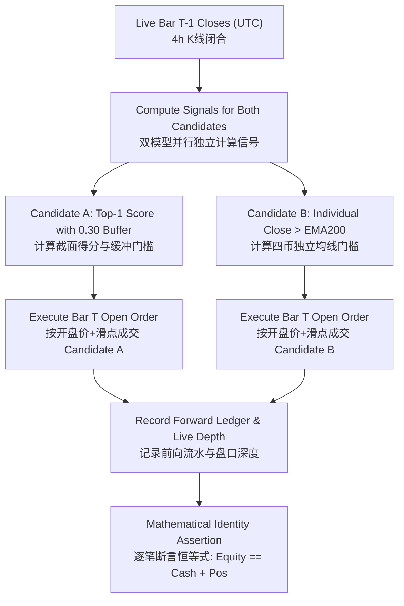

# Forward Paper Tracking & Out-of-Sample Evaluation Protocol
# 前向模拟与真实样本外前瞻跟踪标准协议

---

## 1. Executive Protocol & Epistemological Status / 协议宗旨与科学认识论定位

Following the rigorous completion of:
1. **Exact Baseline Reproducibility** (Clean Git tree, SHA256 checksums of inputs and generated outputs).
2. **Step 1 Advantage Source Attribution** (Proving Trend Cash Defense is the primary source of risk-adjusted alpha; Simple EMA Trend +4040.14% significantly outperforming baseline Top-1 +1121.52%).
3. **Step 2 Component Ablation** (Proving BTC gate, asset gate, and momentum ranking are essential, while 1.5x ATR stop in spot trading adds destructive churn).
4. **Step 3 Drawdown & Churn Diagnostics** (Tracing the -69.95% drawdown to 233 whipsaw trades and demonstrating that Structural Exit + Momentum Buffer 0.30 curtails churn from 1,144 down to 426 trades).
5. **Formal Candidate Reproduction** (Complete artifact package in `reports/experiments/candidate_top1_structural_buffer030/` with audited `manifest.json`, `trades.csv`, `bar_ledger.csv`, `summary.json`, and `annual_breakdown.csv`).

We now declare the historical development and stress-test data (**2020-10-15 to 2026-09-23**) **OFFICIALLY FROZEN**.
No further parameter tuning, indicator fitting, or model selection will be conducted on historical data.

> [!WARNING]
> ### Scientific Tone & Epistemological Calibration / 科学定位与认知校准
> **The historical return of +43,942.30% is an IN-SAMPLE DEVELOPMENT AND BACKTESTING FINDING, NOT an expected forward return rate!**
> 去除 ATR 止损并引入 $\Delta \text{score} = 0.30$ 动量换仓缓冲阀是基于已观察的 2020–2026 全量历史数据进行归因消融后选出的；其“帕累托改进”目前仅在已观察历史中成立。
> 严禁将回测发现当作对未来的确定性收益预期。真正的科学样本外检验，必须且只能依靠在未来实时 4 小时闭合 K 线上进行前瞻模拟跟踪。

---

## 2. Dual Forward Parallel Tracking Benchmarks / 双候选基准并行前向模拟

To prevent sample-specific optimization bias, we establish **two parallel forward models** tracked under 100% identical candle timing, live order book quotes, and friction assumptions (8 bps fee, 5 bps execution slippage):

| Dimension / 维度 | Candidate A (Challenger Group / 实验组) | Candidate B (Parallel Control Group / 对照组) |
| :--- | :--- | :--- |
| **Model Name / 模型名称** | **Core-4 Top-1 Rotation (Structural + Buffer 0.30)** | **Simple Multi-Asset EMA Trend (No Rotation)** |
| **Strategy Logic / 策略逻辑** | Cross-sectional momentum ranking (`BB Z-score + Mom20`) with 0.30 challenger buffer; exits when Asset < EMA200 or BTC < EMA200. | Each of the 4 assets holds 25% sub-portfolio if Close > EMA200, else Cash. **Zero cross-sectional ranking, zero rotation churn**. |
| **Asset Universe / 标的池** | BTCUSDT, ETHUSDT, SOLUSDT, BNBUSDT | BTCUSDT, ETHUSDT, SOLUSDT, BNBUSDT |
| **Capital Allocation / 资金分配** | 100% concentrated in single top-ranked winner | 25% independent budget per asset |
| **Leverage / 杠杆** | 1.0x Spot (现货无借贷) | 1.0x Spot (现货无借贷) |
| **Stop Mechanism / 出场机制** | Pure Structural Trend Exit (Asset / BTC EMA200 line) | Pure Structural Trend Exit (Individual EMA200 line) |
| **Historical Full Cycle Net Return** | **+43,942.30%** (Max DD 53.14%, Sharpe 1.76) | **+4,040.14%** (Max DD 54.00%, Sharpe 1.41) |
| **Historical Full Cycle Trades** | 426 trades | 1,614 entries/exits (403 roundtrips) |
| **Primary Scientific Role / 核心科学定位** | Evaluates whether concentration + momentum buffer can beat diversified trend following forward. | **Strict Control Group (严苛对照基线)**: If Candidate A fails to beat Candidate B in forward tracking, Candidate A's historical superiority will be conclusively rejected as curve-fitting. |

---

## 3. Audited Historical Reference Matrix / 经审计历史逐年对照矩阵

All metrics below are automatically sourced from official experiment artifacts:
- Baseline Top-1 & Candidate B: `reports/experiments/advantage_attribution/advantage_attribution_table.csv`
- Candidate A: `reports/experiments/candidate_top1_structural_buffer030/annual_breakdown.csv`

| Regime / 评估周期 | Candidate A Net Ret (Top-1 Buffer) | Candidate B Net Ret (Simple EMA) | Baseline Top-1 Net Ret (Tight SL) | BTC Buy & Hold | Core-4 Equal-Weight |
| :--- | :--- | :--- | :--- | :--- | :--- |
| **2021 (Bull Expansion)** | **+2,815.71%** (DD 53.1%) | +760.91% (DD 41.9%) | +776.04% (DD 51.7%) | +59.89% (DD 54.1%) | +1,535.66% (DD 56.0%) |
| **2022 (Secular Bear)** | **-8.32%** (DD 39.3%) | -34.46% (DD 46.3%) | -14.05% (DD 41.3%) | -64.68% (DD 67.2%) | -84.02% (DD 84.9%) |
| **2023 (Recovery)** | **+256.84%** (DD 33.0%) | +203.99% (DD 35.3%) | +80.49% (DD 45.0%) | +156.04% (DD 21.2%) | +281.40% (DD 33.6%) |
| **2024 (Choppy ETF)** | **+41.56%** (DD 37.0%) | +24.89% (DD 38.5%) | -13.54% (DD 58.3%) | +121.68% (DD 30.0%) | +90.18% (DD 39.7%) |
| **2025 (Modern Cycle)** | **+57.03%** (DD 42.4%) | +19.81% (DD 24.3%) | +10.52% (DD 44.2%) | -6.39% (DD 34.4%) | -19.97% (DD 57.4%) |
| **2026 (Stress / Dev)** | **+0.13%** (DD 29.1%) | +6.15% (DD 35.7%) | -14.95% (DD 35.3%) | -2.06% (DD 40.0%) | -6.53% (DD 51.0%) |
| **Full Cycle (2020-2026)** | **+43,942.30%** (DD 53.1%) | **+4,040.14%** (DD 54.0%) | **+1,121.52%** (DD 70.0%) | **+652.54%** (DD 77.0%) | **+2,185.45%** (DD 89.1%) |

---

## 4. Forward Paper Tracking Workflow & Decision Rules / 前向执行流水线与判定准则

For every forward 4-hour bar (00:00, 04:00, 08:00, 12:00, 16:00, 20:00 UTC):

### 4.1 Step-by-Step Forward Audit Checklist / 逐根前向审计清单

1. **Closed-Candle Causality / 闭合时点决策**:
   - Signals are calculated *strictly* after the 4-hour candle has officially closed in UTC. No lookahead allowed.
2. **Order Execution at Bar $T$ Open / 开盘时点成交**:
   - Simulated fill price $P_{fill} = P_{open} \times (1 \pm 0.0005)$ (5 bps slippage).
   - Taker fee $Fee = Value \times 0.0008$ (8 bps taker fee).
   - Real-time ticker price recorded to measure live market depth and slippage deviation.
3. **Forward Audit Log Storage / 前向对账日志存储**:
   - Appended to `data/forward_tracking/forward_journal.jsonl`.
   - Appended to `data/forward_tracking/forward_ledger.csv`.
4. **Falsification & Acceptance Criteria / 证伪与验收准则**:
   - **Minimum Evaluation Horizon / 最低评估周期**:
     - Requires at least **180 calendar days (6 months)** of forward continuous tracking OR a minimum of **30 completed roundtrip trades** for Candidate A.
     - Single-month or 60-day short periods are statistically underpowered for 4-hour trend following and are prohibited from being used for final promotion decisions.
   - **Candidate A Acceptance Hurdle / 候选策略 A 验收准则**:
     - Must achieve **positive net excess return ($\Delta \text{Ret} > 0$)** over Candidate B after all actual fees and execution slippage.
     - Must achieve **higher cost-adjusted Sharpe ratio ($\text{Sharpe}_A > \text{Sharpe}_B$)**.
     - Maximum forward drawdown must remain strictly bounded within historical maximum drawdown ($\text{MaxDD} \le 53.14\%$).
   - **Candidate A Rejection & Default Criteria / 候选策略 A 证伪与降级规则**:
     - If Candidate A experiences net underperformance relative to Candidate B ($\Delta \text{Ret} \le 0$) across the 180-day window, or suffers $\text{MaxDD} > 53.14\%$, Candidate A is conclusively rejected as historical overfitting.
     - Upon rejection, the production deployment defaults unconditionally to **Candidate B (Simple Multi-Asset EMA Trend)**.
   - **Development Period Disclosure / 开发区间认识论披露**:
     - The 2026 performance recorded in development (Candidate A: +0.13%, Candidate B: +6.15%) was observed prior to protocol freezing and serves solely as a development stress-test. Genuine out-of-sample forward tracking strictly begins from 2026-09-23 00:00:00 UTC onward.

---

## 5. Summary / 总结

By freezing both **Candidate A (Top-1 Structural + Buffer 0.30)** and **Candidate B (Simple Multi-Asset EMA Trend)** side-by-side, we establish a robust, falsifiable, and un-cherry-picked quantitative foundation. The system eliminates premature claims of victory and adheres to strict scientific verification.
通过将候选策略 A 与对照策略 B 并行固化，本系统确立了可证伪、不挑拣结果的科学研究规范，杜绝过早宣称回测胜利，全面转入实盘前瞻验证阶段。
