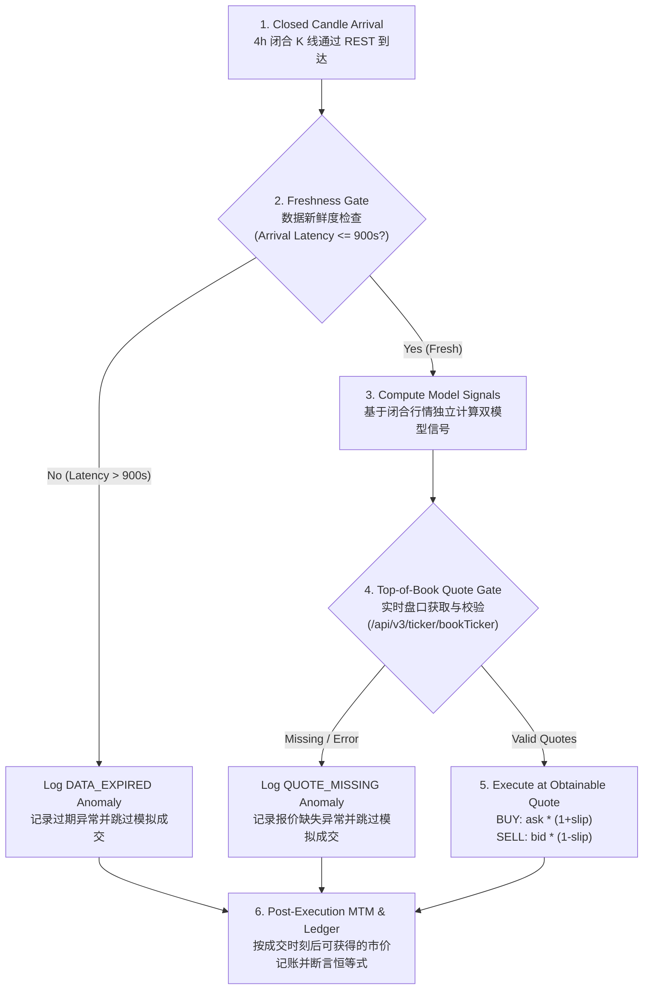

# Forward Paper Tracking & Out-of-Sample Evaluation Protocol
# 前向模拟与真实样本外前瞻跟踪标准协议

---

> [!CAUTION]
> ### Accurate Scientific Positioning & Research Nature / 准确科学定位与研究性质声明
> **The system is currently an operational quantitative research and paper-trading simulation platform. It is NOT yet an empirically forward-verified basis for risking real capital.**
> **本系统当前为一个可试运行的量化研究与前向模拟交易系统，但还不是经前向验证、可据此判断会赚钱并投入真实资金的交易依据。严禁直接依照信号投入真实资金！**
> 
> All historical backtesting findings (including the +43,942.30% in-sample discovery) were derived by observing the full 2020–2026 historical dataset. True out-of-sample forward validation has only just commenced. No capital allocation decisions may be made until the completion of the 180-day / 30-trade forward evaluation horizon under this frozen protocol.
> 所有历史回测发现（包括 +43,942.30% 的全周期开发结果）均是基于对 2020–2026 全量历史数据进行观察消融后得出的历史发现。真正的样本外前瞻检验刚刚开始。在完成本协议规定的 180 天或 30 笔完整交易的前瞻检验周期之前，任何人不得将本系统作为实盘交易决策依据。

---

## 1. Executive Protocol & Epistemological Status / 协议宗旨与科学认识论定位

Following the rigorous completion of:
1. **Exact Baseline Reproducibility** (Clean Git tree, SHA256 checksums of inputs and generated outputs).
2. **Step 1 Advantage Source Attribution** (Proving Trend Cash Defense is the primary source of risk-adjusted alpha; Simple EMA Trend +4040.14% significantly outperforming baseline Top-1 +1121.52%).
3. **Step 2 Component Ablation** (Proving BTC gate, asset gate, and momentum ranking are essential, while 1.5x ATR stop in spot trading adds destructive churn).
4. **Step 3 Drawdown & Churn Diagnostics** (Tracing the -69.95% drawdown to 233 whipsaw trades and demonstrating that Structural Exit + Momentum Buffer 0.30 curtails churn from 1,144 down to 426 trades).
5. **Formal Candidate Reproduction** (Complete artifact package in `reports/experiments/candidate_top1_structural_buffer030/` with audited `manifest.json`, `trades.csv`, `bar_ledger.csv`, `summary.json`, and `annual_breakdown.csv`).

We now declare the historical development and stress-test data (**2020-10-15 to 2026-09-23**) **OFFICIALLY FROZEN**.
No further parameter tuning, indicator fitting, or model selection will be conducted on historical data.

---

## 2. Dual Forward Parallel Tracking Benchmarks / 双候选基准并行前向模拟

To prevent sample-specific optimization bias, we establish **two parallel forward models** tracked under 100% identical candle timing, live order book quotes, and friction assumptions (8 bps fee, 5 bps execution slippage):

| Dimension / 维度 | Candidate A (Challenger Group / 实验组) | Candidate B (Parallel Control Group / 对照组) |
| :--- | :--- | :--- |
| **Model Name / 模型名称** | **Core-4 Top-1 Rotation (Structural + Buffer 0.30)** | **Simple Multi-Asset EMA Trend (No Rotation)** |
| **Strategy Logic / 策略逻辑** | Cross-sectional momentum ranking (`BB Z-score + Mom20`) with 0.30 challenger buffer; exits when Asset < EMA200 or BTC < EMA200. | Each of the 4 assets holds 25% sub-portfolio if Close > EMA200, else Cash. **Zero cross-sectional ranking, zero rotation churn**. |
| **Asset Universe / 标的池** | BTCUSDT, ETHUSDT, SOLUSDT, BNBUSDT | BTCUSDT, ETHUSDT, SOLUSDT, BNBUSDT |
| **Capital Allocation / 资金分配** | 100% concentrated in single top-ranked winner | 25% independent budget per asset |
| **Leverage / 杠杆** | 1.0x Spot (现货无借贷) | 1.0x Spot (现货无借贷) |
| **Stop Mechanism / 出场机制** | Pure Structural Trend Exit (Asset / BTC EMA200 line) | Pure Structural Trend Exit (Individual EMA200 line) |
| **Historical Full Cycle Net Return** | **+43,942.30%** (Max DD 53.14%, Sharpe 1.76) | **+4,040.14%** (Max DD 54.00%, Sharpe 1.41) |
| **Historical Full Cycle Trades** | 426 trades | 1,614 entries/exits (403 roundtrips) |
| **Primary Scientific Role / 核心科学定位** | Evaluates whether concentration + momentum buffer can beat diversified trend following forward. | **Strict Control Group (严苛对照基线)**: If Candidate A fails to beat Candidate B in forward tracking, Candidate A's historical superiority will be conclusively rejected as curve-fitting. |

---

## 3. Strict 5-Step Causal Execution Pipeline / 严密5步因果执行时序

Every 4-hour forward bar (00:00, 04:00, 08:00, 12:00, 16:00, 20:00 UTC) strictly adheres to the following chronological sequence:

### 3.1 Step Details / 时序环节技术细节

1. **Step 1: Closed Candle Arrival & Timestamping / 闭合K线到达**:
   - The runner detects newly closed 4h candles via REST API.
   - Logs `candle_close_time_utc` and physical `data_arrival_time_utc`.
2. **Step 2: Freshness Gate & Staleness Timeout / 新鲜度核验与超时保护**:
   - Computes $\text{latency} = \text{data\_arrival\_time} - \text{candle\_close\_time}$.
   - If $\text{latency} > \text{MAX\_DATA\_STALENESS\_SEC}$ (default 900s / 15 minutes):
     - Logs `DATA_EXPIRED` anomaly into `forward_journal.jsonl`.
     - **Skips simulated order execution entirely** to prevent trading on severely lagged prices.
3. **Step 3: Model Decision on Closed History / 基于闭合行情的纯函数决策**:
   - Candidate A evaluates `compute_top1_decision(hist_closes, current_symbol=curr_pos_a)`.
   - Candidate B evaluates `prev_close > ema200` for all Core-4 assets independently.
4. **Step 4: Top-of-Book Quote Gate / 实时盘口抓取与有效性核验**:
   - If a signal transition is triggered (BUY, SELL, or ROTATE), immediately queries Binance `/api/v3/ticker/bookTicker` for best `bidPrice` and `askPrice`.
   - If quotes are missing, null, or disconnected:
     - Logs `QUOTE_MISSING` anomaly into `forward_journal.jsonl`.
     - **Skips simulated order execution entirely**.
5. **Step 5: Obtainable Quote Execution / 挂钩真实盘口的保守撮合**:
   - Historical open prices from 4 hours ago are strictly forbidden from determining fill prices in live execution!
   - BUY: $\text{exec\_price} = \text{askPrice} \times (1.0 + \text{slippage})$
   - SELL: $\text{exec\_price} = \text{bidPrice} \times (1.0 - \text{slippage})$
   - Deducts taker fee (8 bps) and records slippage relative to top of book.
6. **Step 6: Post-Execution Mark-to-Market Accounting / 成交后真实价格盯市与记账**:
   - When a trade occurs, the position is valued at the prevailing obtainable market price (`actual_bid` or mid-price).
   - If no trade occurs, position is valued at `close_price`.
   - Enforces strict single-ledger accounting identities on every bar.

---

## 4. Total Demarcation: Demo Replay vs Genuine Out-of-Sample / 演示回放与真实样本外完全隔离

To prevent historical artifacts from polluting forward statistics:

1. **Independent Account Initialization / 纯净独立初始账户**:
   - Candidate A starts at `2026-09-23 00:00:00 UTC` with **\$10,000.00 pure cash**, `curr_pos = "USDT_CASH"`, 0 asset units.
   - Candidate B starts at `2026-09-23 00:00:00 UTC` with **\$10,000.00 pure cash (\$2,500.00 per token)**, 0 asset units.
   - Zero carried-over positions or pre-existing returns from historical demonstration.
2. **Physical File Segregation / 物理文件完全独立**:
   - **Genuine Live Forward Tracking**:
     - `data/forward_tracking/status.json`
     - `data/forward_tracking/forward_ledger.csv`
     - `data/forward_tracking/forward_journal.jsonl`
     - `data/forward_tracking/forward_comparison.md`
   - **Offline Demo Replay (Demonstration Only)**:
     - `data/forward_tracking/demo_status.json`
     - `data/forward_tracking/demo_replay_ledger.csv`
     - `data/forward_tracking/demo_journal.jsonl`
     - `data/forward_tracking/demo_comparison.md`
3. **Restart Idempotency / 重启防重幂等机制**:
   - Keyed by `{regime}:{bar_time}` in memory and on disk.
   - Daemon restarts never execute duplicate orders or corrupt cash balances.

---

## 5. Falsification & Acceptance Criteria / 证伪与验收准则

1. **Minimum Evaluation Horizon / 最低评估周期**:
   - Minimum **180 calendar days (6 months)** of forward continuous tracking OR a minimum of **30 completed roundtrip trades** for Candidate A.
   - Single-month or 60-day short periods are prohibited from being used for capital allocation decisions.
2. **Candidate A Acceptance Hurdle / 候选策略 A 验收准则**:
   - Positive net excess return over Candidate B ($\Delta \text{Ret} = \text{Ret}_A - \text{Ret}_B > 0$).
   - Higher cost-adjusted Sharpe ratio ($\text{Sharpe}_A > \text{Sharpe}_B$).
   - Forward maximum drawdown strictly $\le 53.14\%$.
3. **Candidate A Rejection & Default Criteria / 候选策略 A 证伪与降级规则**:
   - If Candidate A underperforms Candidate B forward ($\Delta \text{Ret} \le 0$) or suffers $\text{MaxDD} > 53.14\%$, Candidate A is conclusively rejected as historical overfitting.
   - Upon rejection, the production deployment defaults unconditionally to **Candidate B (Simple Multi-Asset EMA Trend)**.
