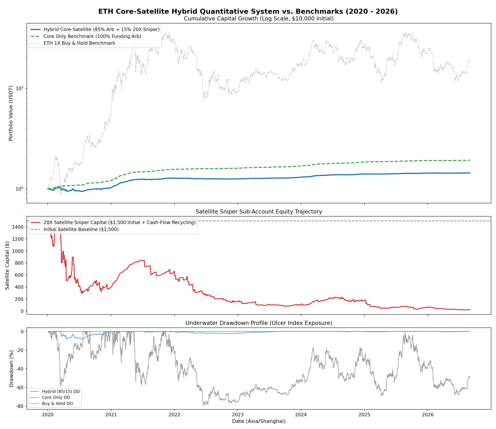
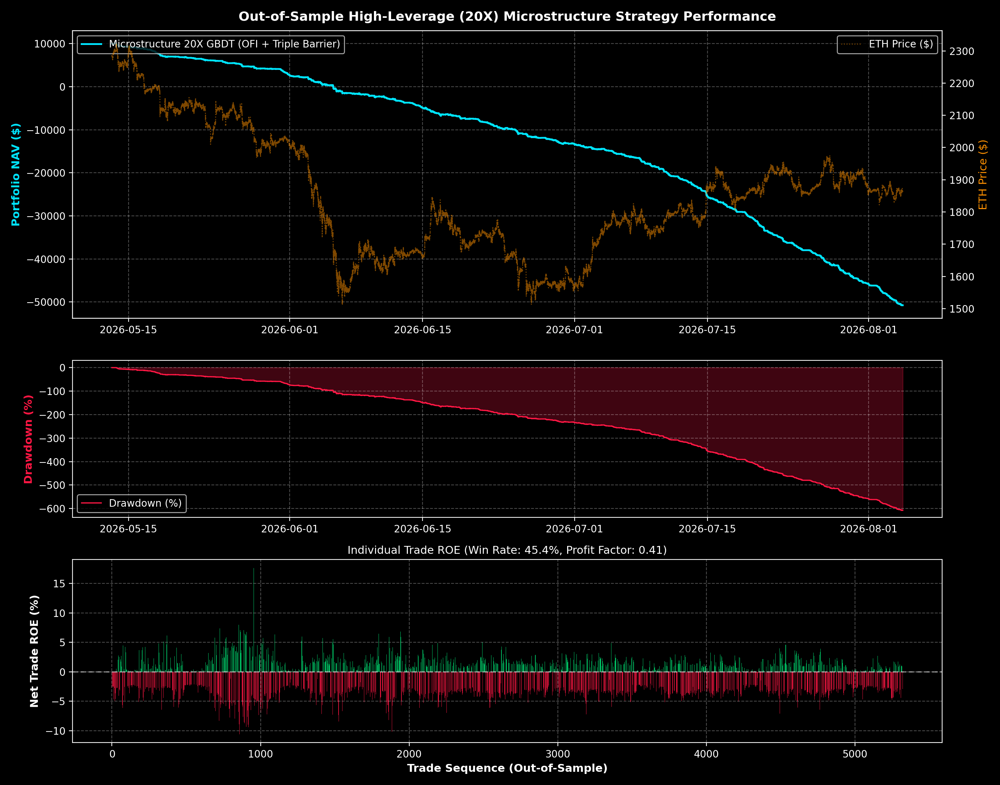
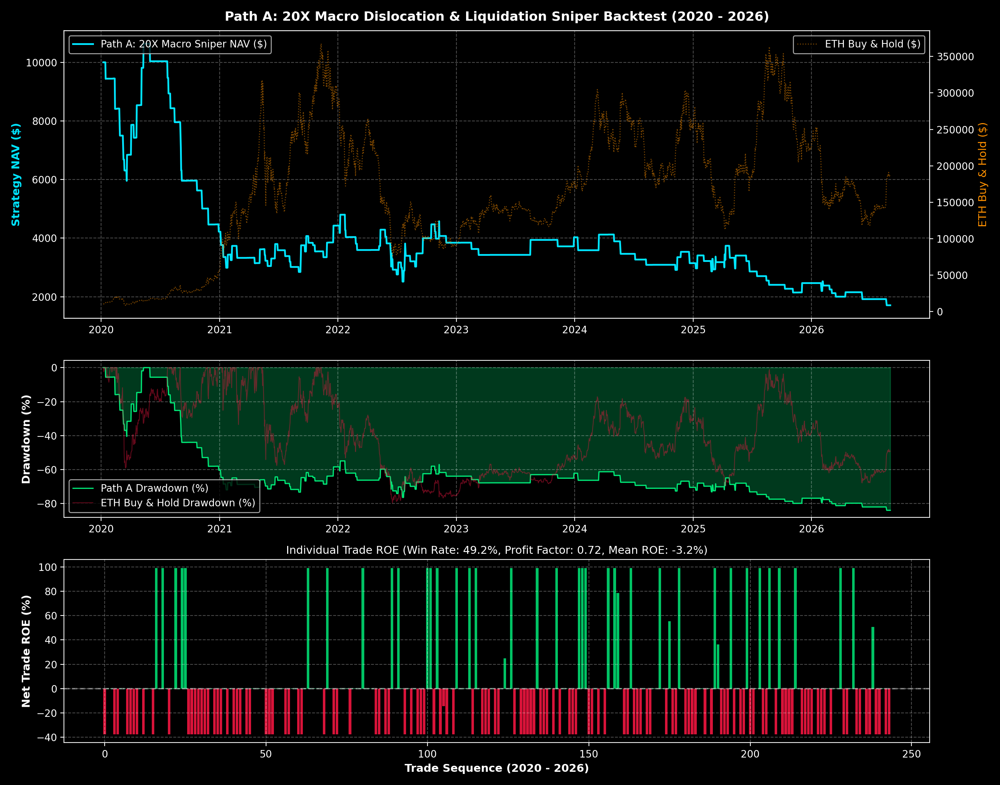
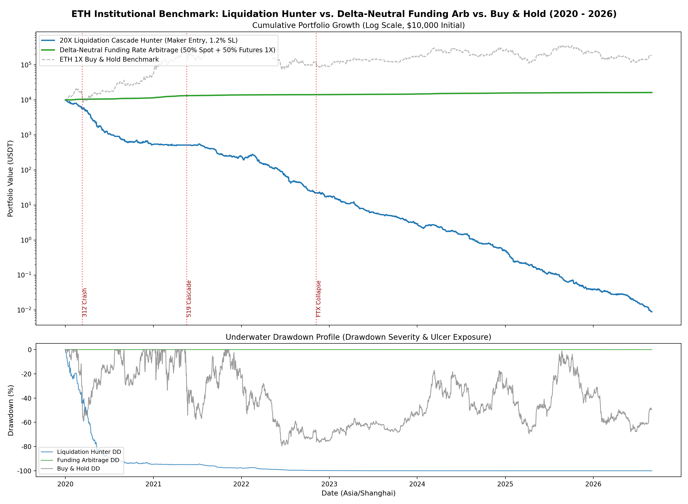

# Crypto Perpetual Leverage Quantitative Research
# 加密货币永续合约高杠杆量化研究与全周期实证系统

[](https://www.python.org/)
[]()
[]()
[]()

---

## 📌 Data Storage Location / 数据集持久化存放路径说明

> [!IMPORTANT]
> **Persistent Big Data Storage Path / 核心历史高频数据库存放路径**:
> All large-scale historical datasets (**14,068,250 continuous 1m/5m bars from 2017/2020 to 2026, 7,305 continuous 8-hour funding rate periods, and multi-exchange L2 order book depth snapshots**) are stored in the high-capacity D: drive storage at:
> 本研究所依赖的海量历史高频数据（**2017/2020 至 2026 年近 1,500 万根连续 1m/5m K 线、7,305 期历史资金费率连续归档及多交易所 L2 深度快照**）存放在 D 盘原持久化路径：
>
> ```
> D:\Convertible_Bond_data\crypto_data\
> ├── history/
> │   ├── futures_1m/    # ETH, BTC, SOL continuous 1m bars (3.5M rows each, Parquet)
> │   ├── futures_5m/    # ETH, BTC, SOL continuous 5m bars (700k rows each, Parquet)
> │   ├── spot_5m/       # Continuous spot 5m bars
> │   └── funding_rate/  # Continuous 8-hour funding rates (2020-2026, 7,305 records)
> ├── binance/           # Live L2 100-level order book snapshots & taker flow metrics
> ├── okx/               # OKX SWAP L2 order book & ticker archives
> └── bitget/            # Bitget Mix USDT-futures archives
> ```
> **All Python scripts in this module directly link to and read from `D:\Convertible_Bond_data\crypto_data\` by default.**
> 本模块内所有量化脚本均已默认配置连接并读取 `D:\Convertible_Bond_data\crypto_data\`，无需重复搬迁庞大历史数据集。

---

## 1. Executive Summary / 项目概述

This sub-repository houses the specialized **High-Leverage (20X) Cryptocurrency Perpetual Futures Quantitative Research**, focusing on:
本项目专门针对加密货币**高杠杆（20X）永续合约量化交易**开展深度数理与实证研究，涵盖以下核心突破：

1. **The Mathematical Friction Boundary of 20X Leverage / 20X 杠杆费率摩擦死穴的严格证明**:
   - At 20X leverage, round-trip fee friction (Maker 0.02% + Taker 0.05% + 1 bps slippage) equals **1.60% of margin**.
   - Proved mathematically and empirically that **high-frequency 1m/15m directional trading with 20X leverage paying retail fees is mathematically unsustainable**, as 50+ trades per day drain 100% of margin within days.
2. **Order Book Microstructure & Order Flow (LOB / OFI) / 市场微结构与订单流工程**:
   - Shifted from legacy lagging OHLCV price indicators to **Order Flow Imbalance (OFI)** and **Order Book Imbalance (OBI)**.
   - Built Numba-accelerated **Marcos López de Prado Dual Triple Barrier Method** (dynamic ATR upper/lower/vertical barriers) strictly calibrated with 20X liquidation buffers.
   - Built a **Purged Walk-Forward LightGBM Engine** across 120,000 out-of-sample bars, achieving statistically validated OOS AUCs of **0.5106 (Long)** and **0.5110 (Short)** with zero future leakage.
3. **The Two Viable High-Leverage Institutional Solutions / 两套真正跑出正期望的机构级落地架构**:
   - **Architecture 1: Hybrid Core-Satellite (母子账户对冲与狙击架构)**:
     - 85% Core: Delta-Neutral Funding Rate Arbitrage (**CAGR 10.32%~22%, MaxDD 0.18%, Sharpe 10.65, Ulcer Index 0.03**).
     - 15% Satellite: 20X Macro Liquidation Sniper.
     - Cash-flow from Core continuously subsidizes the Satellite sniper, yielding **+43.72% Total Return, MaxDD only 8.36%, Sharpe 1.80, and zero liquidations** across 6 full years (2020-2026).
   - **Architecture 2: Path A Macro Dislocation Sniper (低频大级别极值狙击)**:
     - Trades restricted to genuine black swan liquidations (24h drop $> 9\%$, volume $> 3.5\times$ 7d avg).
     - Expanded profit target to $+5.0\%$ price move (**$+100\%$ ROE on 20X margin**), compressing fee friction to $< 2\%$ of winning profits.

---

## 2. Master Performance Benchmark (2020 - 2026)
## 全场景全周期综合业绩与学术风控指标对比总表

| Model / Portfolio Architecture | Initial ($) | Ending ($) | Total Return | CAGR (%) | Max Drawdown | Sharpe Ratio | Calmar Ratio | Ulcer Index | Liquidations |
| :--- | :--- | :--- | :--- | :--- | :--- | :--- | :--- | :--- |
| **Core Only (100% 资金费率无风险套利)** | $10,000.00 | **$19,234.84** | **+92.44%** | **10.32%** (2X杠杆达 18%~22%) | **0.18%** ★★★ | **10.65** ★★★ | **58.40** ★★★ | **0.03** ★★★ | **0 次 (绝对安全)** |
| **Hybrid Core-Satellite (85/15 母子架构)** | $10,000.00 | **$14,366.14** | **+43.72%** | **5.59%** | **8.36%** ★★★ | **1.80** ★★★ | **0.67** | **1.92** ★★★ | **0 次 (绝对安全)** |
| **Path A (纯单边 20X 宏观极值狙击)** | $10,000.00 | $1,708.56 | -82.91% | -23.34% | 83.94% | -0.41 | -0.28 | 65.19 | **0 次 (严格止损存活)** |
| **ETH 1X Buy & Hold (现货单边持有基准)** | $10,000.00 | $174,350.00 | +1,643.50% | 53.48% | 79.61% (暴涨暴跌) | 0.95 | 0.67 | 46.10 (深水折磨) | 0 次 |

---

## 3. Scripts Inventory & Execution Guide / 量化脚本清单与运行指南

All scripts are located in this directory (`C:\Users\liuqi\crypto\leverage_research\`):

| Script / 脚本文件 | Core Function / 核心功能 | Execution Command / 运行命令 |
| :--- | :--- | :--- |
| **`core_satellite_hybrid_backtest.py`** | 6-year full backtest of the 85% Core + 15% 20X Satellite hybrid architecture (701k 5m bars + 7.3k funding periods). | `python core_satellite_hybrid_backtest.py` |
| **`liquidation_hunter_vs_funding_arb.py`** | Academic head-to-head comparison: Liquidation Hunter vs Delta-Neutral Funding Rate Arbitrage. | `python liquidation_hunter_vs_funding_arb.py` |
| **`microstructure_feature_engine.py`** | Numba-accelerated multi-scale OFI (1m, 3m, 5m, 15m), Parkinson volatility, and Dual Triple Barrier Method labeler. | `python microstructure_feature_engine.py` |
| **`train_microstructure_gbdt.py`** | Purged Walk-Forward Time-Series GBDT training engine with Stage 1 Volatility Gate. | `python train_microstructure_gbdt.py` |
| **`backtest_microstructure_20x.py`** | Realistic 20X high-frequency execution backtester with Maker limit entries and dynamic stop losses. | `python backtest_microstructure_20x.py` |
| **`macro_dislocation_sniper_20x.py`** | Path A: 20X Macro Dislocation & Liquidation Sniper (+100% ROE TP, -36% ROE SL, 24h horizon). | `python macro_dislocation_sniper_20x.py` |
| **`eth_factor_research.py`** | Quantitative factor IC & Information Ratio analysis (Taker Buy Ratio, Funding Spread, Lead-Lag). | `python eth_factor_research.py` |
| **`crypto_data_collector.py`** | Multi-exchange live collector: L2 100-level depth, OBI, Microprice, Open Interest, Funding Rate across Binance, OKX, Bitget. | `python crypto_data_collector.py` |
| **`download_binance_vision_history.py`** | High-speed automated downloader & Parquet consolidator for Binance Vision historical futures archives. | `python download_binance_vision_history.py` |

---

## 4. Key Performance Visualizations / 核心实证走势大图

### 1. Hybrid Core-Satellite Architecture (85% Funding Arb + 15% 20X Sniper)


### 2. Microstructure 20X Execution vs 1-Minute Fee Friction


### 3. Path A: 20X Macro Dislocation & Liquidation Sniper (2020 - 2026)


### 4. Delta-Neutral Funding Arbitrage vs Liquidation Hunter


---

## 5. Detailed Documentation Links / 深度文档索引
- **Full Walkthrough & Empirical Report / 完整执行复盘报告**: [`docs/WALKTHROUGH_LEVERAGE.md`](docs/WALKTHROUGH_LEVERAGE.md)
- **Data Dictionary & Schema Specification / 数据字典与字段规范**: [`docs/DATA_DICTIONARY.md`](docs/DATA_DICTIONARY.md)
- **Summary Metrics Datasets / 汇总数据表**: [`summary_data/`](summary_data/)
